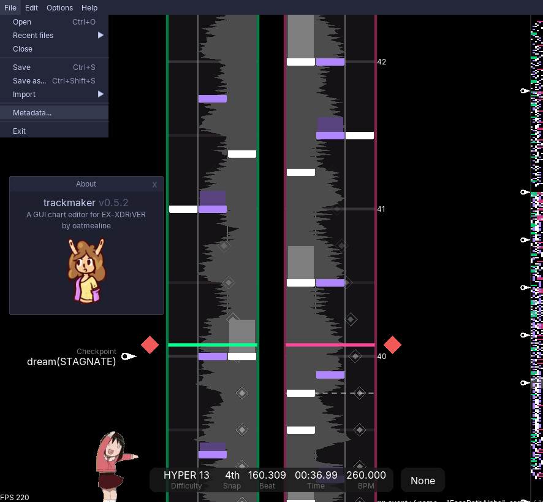

# trackmaker



Heavily work-in-progress GUI chart editor for
[EX-XDRiVER](https://store.steampowered.com/app/2636020/EXXDRiVER/) written with
[LÖVE](https://love2d.org/).

## Run

Download a [release](https://github.com/oatmealine/trackmaker/releases), and follow the instructions:

- **Windows**: Download and extract `trackmaker-win64.zip`, then run `trackmaker.exe`.
- **OS X**: _No Mac builds are currently available! If you are a Mac user, please get in contact so I can try and test a Mac build. In the meantime, follow [the instructions here](#develop)._
- **Linux**: Download and extract `trackmaker-linux.zip`, and install [LÖVE](https://love2d.org) from your distribution's package manager (`love2d` in most repos). Run `start.sh`.

## Develop

0. Clone the repository:

    ```sh
    git clone https://github.com/oatmealine/trackmaker
    ```

1. Get [nfd](https://github.com/Vexatos/nativefiledialog/tree/master/lua) w/ [luarocks](https://luarocks.org):
  
    ```sh
    luarocks install https://raw.githubusercontent.com/Vexatos/nativefiledialog/master/lua/nfd-scm-1.rockspec --local
    ```

2. Drop it in the same folder as this repository:

    ```sh
    # for instance, on linux:
    cp ~/.luarocks/lib/lua/5.1/nfd.so ./
    ```

3. Run with [LÖVE](https://love2d.org/):

    ```sh
    love .
    ```

## Contributing

Feel free to contribute anything you'd like to see. I'm following a pretty
specific vision with the editor, but **contributions are always appreciated**
and I'll always try my best to work out how to fit them well. Thank you!

## Credits

This project would not be possible without these projects:

- [LÖVE](https://love2d.org/)
- [json.lua](https://github.com/rxi/json.lua)
- [classic](https://github.com/rxi/classic)
- [Vexatos](https://github.com/Vexatos)'s fork of
[nativefiledialog](https://github.com/Vexatos/nativefiledialog)
- [Lönn](https://github.com/CelestialCartographers/Loenn/): A lot of the
nativefiledialog handling code is stolen from them. Thank you very much!

And these people:

- [tari](https://github.com/tari-cat), [riley](https://github.com/rilegoat), and
the rest of the [EX-XDRiVER team](https://xdrv.team). Thank you!